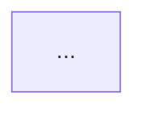

$ARGUMENTS について**章ごとに磨き上げる詳細計画**を作成。記事のultraplan相当を自家製実現。

# 構造

5章構成で計画書を作る。各章でadvisor合議を回す。

## 章1: コンテキストと目的
- なぜこれが必要か（ビジネス目的）
- 解決する課題（誰の何を）
- 制約条件（時間・予算・人員・技術）
- 成功基準（定量）

→ **product-advisor** に質問させて要件を磨く

## 章2: アプローチ比較
- 案A、案B、案C（最低3案）
- それぞれのトレードオフ
- 採用案と理由

→ **principal-advisor** + **gemini-advisor** + **codex-advisor** で多角検証

## 章3: 設計詳細
- アーキ図（mermaid等で）
- データモデル変更
- API契約
- マイグレーション戦略
- ロールバック戦略

→ **principal-advisor** + **security-advisor**

## 章4: 実装計画
- フェーズ分け（PR単位）
- 各フェーズの工数見積
- 依存関係・並列可能性
- マイルストーン
- 担当割当

→ Claude本体で詳細化

## 章5: リスクと対策
- 技術リスク
- 運用リスク
- スケジュールリスク
- 撤退基準

→ **/pre-mortem** を実行して失敗シナリオ列挙

# 出力フォーマット

```markdown
# Ultraplan: $ARGUMENTS

最終更新: YYYY-MM-DD HH:MM

---

## 章1: コンテキストと目的

### 背景
...

### 解決する課題
- 誰の: ...
- 何を: ...
- どのくらい: ...

### 制約
| 項目 | 値 | 根拠 |
|---|---|---|
| 期限 | ... | ... |
| 予算 | $XX,XXX | ... |
| 人員 | N人月 | ... |
| 技術制約 | ... | ... |

### 成功基準
- [ ] 定量基準1: ...
- [ ] 定量基準2: ...
- [ ] 定性基準: ...

### Out of Scope
- ...

---

## 章2: アプローチ比較

### 案A: ...
- 概要: ...
- メリット: ...
- デメリット: ...
- 工数: ...

### 案B: ...
（同様）

### 案C: ...
（同様）

### 比較表
| 観点 | 案A | 案B | 案C |
|---|---|---|---|
| 工数 | ... | ... | ... |
| リスク | ... | ... | ... |
| 長期保守性 | ... | ... | ... |
| コスト | ... | ... | ... |

### 採用案: 案X
理由: ...

---

## 章3: 設計詳細

### アーキ


### データモデル変更
- 新規テーブル: ...
- 既存テーブル変更: ...
- インデックス: ...

### API契約
| エンドポイント | メソッド | 変更 |
|---|---|---|
| /api/... | POST | 新規 |
| /api/... | GET | 後方互換 |

### マイグレーション戦略
1. ...
2. ...

### ロールバック戦略
- 各フェーズのロールバック手順
- データ整合性の担保

---

## 章4: 実装計画

### フェーズ分け
| Phase | 内容 | 工数 | 依存 |
|---|---|---|---|
| 1 | ... | 3日 | - |
| 2 | ... | 5日 | Phase 1 |
| 3 | ... | 2日 | Phase 1 |

### マイルストーン
- M1（YYYY-MM-DD）: ...
- M2（YYYY-MM-DD）: ...
- M3（YYYY-MM-DD）: ローンチ

### PR分割案
- PR1: ...（Phase 1）
- PR2: ...（Phase 2）
- ...

---

## 章5: リスクと対策

### 高優先度リスク

#### R1: ...
- 確からしさ: 高/中/低
- インパクト: 致命的/大/中/小
- 対策: ...
- 撤退基準: ...

#### R2: ...
（同様）

### モニタリング指標
- ...

### 撤退判断
- M1時点で...ならフェーズ2中止
- M2時点で...ならロールバック
```

# 使い方

```
/ultraplan auth serviceをsessionからJWTに移行
/ultraplan JACCS RAG basement のpgvector→S3 Vectors移行
/ultraplan Mirumiru Project のWeb版からNative版への移植
```

# 必要な情報

実行前に以下が揃っていると精度上がる:
- 関連の既存コード or 設計書
- ステークホルダー（誰が決裁するか）
- 期限・予算の目安
- 既存のCLAUDE.mdに記録された制約

# 注意

- フル実行は40〜80分かかる（advisor合議含む）
- コスト目安 $1〜$3
- 最終的に**人間が判断**する素材。Claudeの結論をそのまま採用しない
